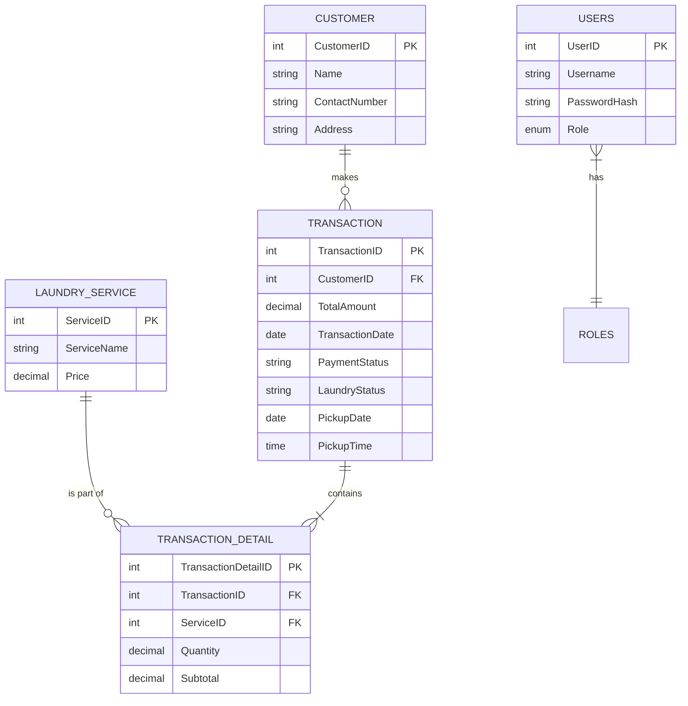

# DingDong's Laundry Station - Management System

> [!IMPORTANT]
> **Project Status**: This system is currently in **Phase 1** of development and is considered a "Work in Progress" (Production Mode). Features are being actively refined.

## 🧺 About the System
DingDong's Laundry Station is a computerized management system designed to streamline the operations of a modern laundry business. It runs as a **desktop application** (via Electron) and replaces manual paper-based tracking with a digital portal where staff can:
- **Register Customers**: Save contact details and service addresses.
- **Record Transactions**: Create new laundry orders with specific weights and services.
- **Schedule Pickups**: Precisely set when a customer should return for their laundry.
- **Manage Payments**: Track "Pending" vs "Approved" payments with a secure one-way approval workflow.
- **Download Receipts**: Save a professional PDF receipt directly to your computer.
- **Print Receipts**: Send the receipt directly to any connected printer.
- **Track Performance**: View daily revenue and pending order "Waitlists" at a glance.

---

## 🛠️ Technology Stack

### Desktop Shell
- **Electron**: Wraps the web app into a standalone desktop application. The app runs natively on Windows without needing a web browser.

### Frontend (The User Interface)
- **React (Vite)**: A fast and efficient way to build the "Staff Portal" UI.
- **Tailwind CSS**: Used to create the premium, clean, and responsive design (the indigo and emerald colors).
- **Lucide React**: Provides the clear icons used throughout the dashboard and menus.
- **SweetAlert2**: Powers the professional-looking pop-ups and confirmation boxes.
- **html2canvas + jsPDF** *(installed, no longer primary)*: PDF utilities; superseded by Electron's native `printToPDF`.

### Backend (The Brains & Storage)
- **PHP**: Handles the API logic between the interface and the database.
- **MySQL**: The database where all customer and transaction information is safely stored.

---

## 📊 Database Design (ERD)



---

## 🔄 System Workflow

1. **Staff Login**: The staff or admin logs into the portal using their credentials.
2. **Customer Registration/Selection**:
   - If it's a new customer, the staff adds their profile in the **Customers** tab.
   - If they are a returning customer, the staff searches for and selects them.
3. **Creating an Order (Transaction)**:
   - The staff selects the services the customer wants (e.g., Wash & Fold).
   - Staff enters the weight (kg) for each service.
   - The system automatically calculates the subtotal and total amount.
4. **Pickup Scheduling**:
   - In the final step of the order, the staff selects a specific **Pickup Date** and **Pickup Time**.
5. **Receipt Generation**:
   - Once saved, the system generates a professional **Official Receipt** with the order details and scheduled pickup info.
   - Staff can choose to **Download** it as a PDF or **Print** it directly.
6. **Operational Monitoring**:
   - The order appears in the **Waitlist** on the Dashboard and the **Orders** tab.
7. **Payment Approval**:
   - When the customer pays, the staff marks the status from **Pending** to **Approved**.
   - This is a one-way check — once approved, it cannot be reversed.
8. **Completion**: Once the laundry is picked up, the transaction cycle is complete.

---

## 🚀 How to Install & Run

### Prerequisites
- **Node.js** (v18+)
- **PHP** (v8+) — included with XAMPP
- **MySQL** — included with XAMPP

### 1. Database Setup
1. Open phpMyAdmin (or any MySQL client).
2. Create a new database named `laundry_station`.
3. Import the `database.sql` file from the project folder.

### 2. Install Dependencies
Open a terminal in the project folder and run:
```bash
npm install
```

### 3. Start the Application
Run the following single command to start everything (API server + Vite dev server + Electron window) all at once:
```bash
npm start
```

This will:
- Start the **PHP API server** at `http://127.0.0.1:8000`
- Start the **Vite dev server** at `http://localhost:5173`
- Launch the **Electron desktop window**

> [!NOTE]
> Make sure XAMPP's MySQL service is running before launching the app.

---

## 🔐 Default Login Accounts
| Role | Username | Password |
|------|----------|----------|
| Admin / Owner | `admin` | `password` |
| Staff | `staff` | `password` |

> [!CAUTION]
> Passwords should be updated in the database before actual deployment.

---

## 📋 Recent Updates

### v1.1 — Receipt Download & Polish
- **Download Receipt as PDF**: Clicking "Download" in the receipt modal now saves a proper PDF file to your computer via Electron's native `printToPDF`. A save dialog lets you choose the location.
- **Separate Print & Download**: "Print" opens the system print dialog; "Download" saves a PDF — they are now distinct, independent actions.
- **Fixed Close Button Icon**: The receipt modal's close button was previously using an icon that looked like a download arrow. It now correctly shows an ✕ icon.
- **Download Icon in Orders List**: The receipt action button in the Orders tab now uses a download icon for clarity.
- **Receipt Inline Styles**: The receipt component was refactored to use inline CSS so it renders correctly in the exported PDF (independent of Tailwind CSS).
