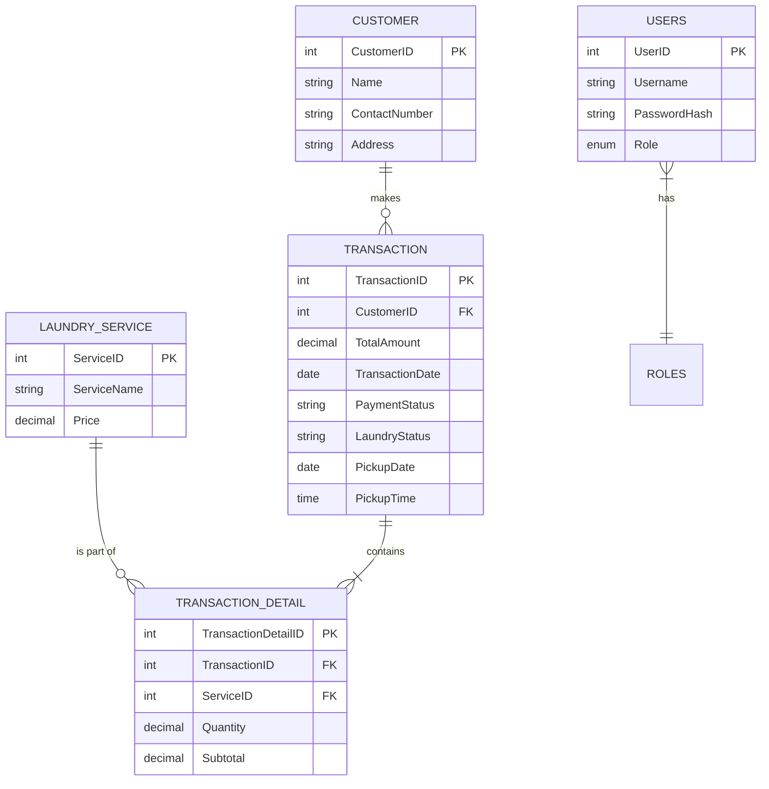

# DingDong's Laundry Station - Management System

> [!IMPORTANT]
> **Project Status**: This system is currently in **Phase 1** of development and is considered a "Work in Progress" (Production Mode). Features are being actively refined.

## 🧺 About the System
DingDong's Laundry Station is a computerized management system designed to streamline the operations of a modern laundry business. It replaces manual paper-based tracking with a digital portal where staff can:
- **Register Customers**: Save contact details and service addresses.
- **Record Transactions**: Create new laundry orders with specific weights and services.
- **Schedule Pickups**: Precisely set when a customer should return for their laundry.
- **Manage Payments**: Track "Pending" vs "Approved" payments with a secure approval workflow.
- **Print Receipts**: Generate clean, professional receipts optimized for any printer.
- **Track Performance**: View daily revenue and pending order "Waitlists" at a glance.

---

## 🛠️ Technology Stack
We used a modern and reliable set of tools to build this system:

### Frontend (The User Interface)
- **React (Vite)**: A fast and efficient way to build the "Staff Portal" you see in the browser.
- **Tailwind CSS**: Used to create the premium, clean, and responsive design (the indigo and emerald colors).
- **Lucide React**: Provides the clear icons used throughout the dashboard and menus.
- **SweetAlert2**: Powers the professional-looking pop-ups and confirmation boxes.

### Backend (The Brains & Storage)
- **PHP**: The language used to handle the logic between the interface and the data.
- **MySQL**: The database where all your customer and transaction information is safely stored.

---

## 📊 Database Design (ERD)
The system is built on a structured database. Below is the Entity Relationship Diagram (ERD) showing how different pieces of information connect:



---

## 🔄 System Workflow (The Flow)
Here is how the system typically operates, from a customer arriving to picking up their laundry:

1.  **Staff Login**: The staff or admin logs into the portal using their credentials.
2.  **Customer Registration/Selection**:
    -   If it's a new customer, the staff adds their profile in the **Customers** tab.
    -   If they are a returning customer, the staff searches for and selects them.
3.  **Creating an Order (Transaction)**:
    -   The staff selects the services the customer wants (e.g., Wash & Fold).
    -   Staff enters the weight (kg) for each service.
    -   The system automatically calculates the subtotal and total amount.
4.  **Pickup Scheduling**:
    -   In the final step of the order, the staff selects a specific **Pickup Date** and **Pickup Time**.
5.  **Receipt Generation**:
    -   Once saved, the system generates a professional **Official Receipt** containing the order details and the scheduled pickup info.
    -   This receipt is printed and given to the customer.
6.  **Operational Monitoring**:
    -   The order appears in the **Waitlist** on the Dashboard and the **Orders** tab.
    -   Staff can see who is coming today and exactly what time they are expected.
7.  **Payment Approval**:
    -   When the customer pays, the staff marks the status from **Pending** to **Approved** in the Orders list.
    -   This is a one-way security check to ensure once a payment is "Approved", it stays that way.
8.  **Completion**:
    -   Once the laundry is picked up, the transaction cycle is complete.

---

## 🚀 How to Install & Run

### 1. Database Setup
1. Open your database management tool (like phpMyAdmin or MySQL Workbench).
2. Create a new database named `laundry_station`.
3. Import the `database.sql` file provided in the project folder to set up all tables and default services.

### 2. Start the Backend API
The system needs a "bridge" to talk to the database:
1. Open a terminal or command prompt in the project folder.
2. Run the following command:
   ```bash
   php -S 127.0.0.1:8000 -t api
   ```
   *Note: Ensure PHP is installed on your system.*

### 3. Start the Frontend Application
1. Open a *second* terminal window in the project folder.
2. Install the necessary files:
   ```bash
   npm install
   ```
3. Start the application:
   ```bash
   npm run dev
   ```
4. Clicking the link provided in the terminal (usually `http://localhost:5173`) will open the Staff Portal.

---

## 🔐 Default Login Accounts
- **Admin**: `admin` / `password` (used for financial reports)
- **Staff**: `staff` / `password` (used for daily orders)

*Note: Passwords should be updated in the database for actual deployment.*
